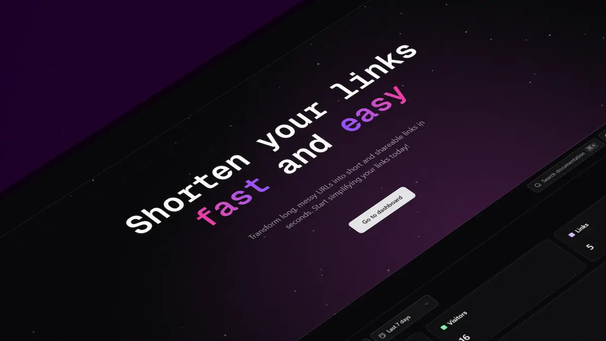

## About the Project

Shortleap is an open-source URL shortener built with modern web technologies. It allows users to transform long, unwieldy URLs into clean, compact links that are easier to share across platforms. The project provides a clean, responsive interface with advanced features like click tracking, analytics, and user authentication.

Shortleap stands out with its beautiful, responsive UI components and smooth animations, delivering a premium user experience while maintaining high performance. The project emphasizes accessibility and user-friendly design principles throughout.



## Built With


## Key Features

### 🔗 Lightning-Fast URL Shortening

Turn long, messy URLs into clean, shareable links instantly. Shortleap creates unique, customizable slugs and stores them securely in a high-performance Turso database.

### 🔐 Seamless Authentication

Login and registration powered by NextAuth, supporting email/password and OAuth (GitHub, Google). JWT-based sessions with protected routes ensure both security and fluid UX.

### 📊 Built-in Analytics Dashboard

Track every visit to your links with precision. View detailed metrics like timestamp, browser, OS, country, city, and device type — all visualized with interactive bar and pie charts.

### 📱 Responsive & Accessible UI

Designed mobile-first and fully responsive using Tailwind CSS. Optimized for accessibility and keyboard navigation. Works perfectly across devices and screen sizes.

### 🌗 Theme-aware Experience

Supports light and dark themes, adapting intelligently to the user's system preferences. Images and visuals update dynamically to match the selected theme.

### 🎨 Smooth Animations

Framer Motion powers elegant transitions and hover effects throughout the interface, adding polish and clarity without compromising performance.

### 📎 Easy Link Management

Logged-in users can create, edit, delete, and search for their short URLs from a personal dashboard with instant feedback and real-time updates.

### 📷 Instant QR Generation & Copy to Clipboard

Every short link includes a one-click QR code generator and copy-to-clipboard functionality — ideal for mobile sharing and offline access.

### 🌍 Server-Side Click Tracking

Custom Next.js middleware handles click redirection and logs visitor metadata on the server for reliability, speed, and security.

### 🧩 Modern Stack

Built with Next.js, TypeScript, Turso (SQLite), Drizzle ORM, Tailwind CSS, Framer Motion, and Zod — bringing together performance, scalability, and developer happiness.

<!-- GETTING STARTED -->

## Getting Started

### Prerequisites

- Node.js 18.0.0 or later
- pnpm (recommended) or npm
- Git

### Installation

1. Clone the repository:

   ```sh
   git clone https://github.com/Whisperpiano/url-shortener.git
   ```

2. Navigate to the project directory:

   ```sh
   cd url-shortener
   ```

3. Install dependencies:

   ```sh
   pnpm install
   ```

4. Create a `.env.local` file in the root directory with the following variables:

   ```
    # Required - Database (Turso)
    TURSO_DATABASE_URL="your_turso_database_url"
    TURSO_AUTH_TOKEN="your_turso_auth_token"

    # Required - Authentication
    AUTH_SECRET="your_auth_secret"
    AUTH_DRIZZLE_URL="your_auth_drizzle_url"

    # Optional - OAuth Providers (needed for social logins)
    AUTH_GITHUB_ID="your_github_id"
    AUTH_GITHUB_SECRET="your_github_secret"
    AUTH_GOOGLE_ID="your_google_id"
    AUTH_GOOGLE_SECRET="your_google_secret"

    # Optional - Cloudinary (needed for image uploads)
    NEXT_PUBLIC_CLOUDINARY_CLOUD_NAME="your_cloud_name"
    NEXT_PUBLIC_CLOUDINARY_API_KEY="your_api_key"
    CLOUDINARY_API_SECRET="your_api_secret"
    CLOUDINARY_URL="your_cloudinary_url"

    # Optional - GitHub API (needed for GitHub integrations)
    GITHUB_TOKEN="your_github_token"
   ```

5. Generate and migrate the database schema:

   ```sh
   pnpm db:reset
   # or npm run db:reset
   ```

6. Start the development server:

   ```sh
   pnpm dev
   # or npm run dev
   ```

> **Security notice**:
> Never expose your environment variables in public repositories. The Turso tokens, NextAuth secret, and other sensitive information should be kept private.

## Contributing

Contributions are what make the open source community such an amazing place to learn, inspire, and create. Any contributions you make are **greatly appreciated**.

If you have a suggestion that would make this better, please fork the repo and create a pull request. You can also simply open an issue with the tag "enhancement".
Don't forget to give the project a star! Thanks again!

1. [Fork](https://github.com/Whisperpiano/url-shortener/fork) the Project.
2. Clone your fork (`git clone <URL of your fork>`)
3. Create your Feature Branch (`git checkout -b feature/AmazingFeature`)
4. Make your changes to the codebase.
5. Commit your Changes (`git commit -m 'Add some AmazingFeature'`)
6. Push to the Branch (`git push origin feature/AmazingFeature`)
7. Open a Pull Request to the `main` branch of the original repository. Provide a clear description of the changes you made and why they are necessary.

<!-- LICENSE -->

## License

This project is licensed under the MIT License. This means you are free to use, modify, and distribute this software as long as the original license is included with any distributions or derivative works.

<!-- CONTACT -->

## Contact

[](https://www.linkedin.com/in/jes%C3%BAs-alberola-herrero-896b61189/)
[](mailto:jesusalberola90@gmail.com)
[](https://www.facebook.com/jesus.alberolaherrero/)
[](https://www.instagram.com/whispers_piano/)

[linkedin-shield]: https://img.shields.io/badge/LinkedIn-0077B5?style=for-the-badge&logo=linkedin&logoColor=white
